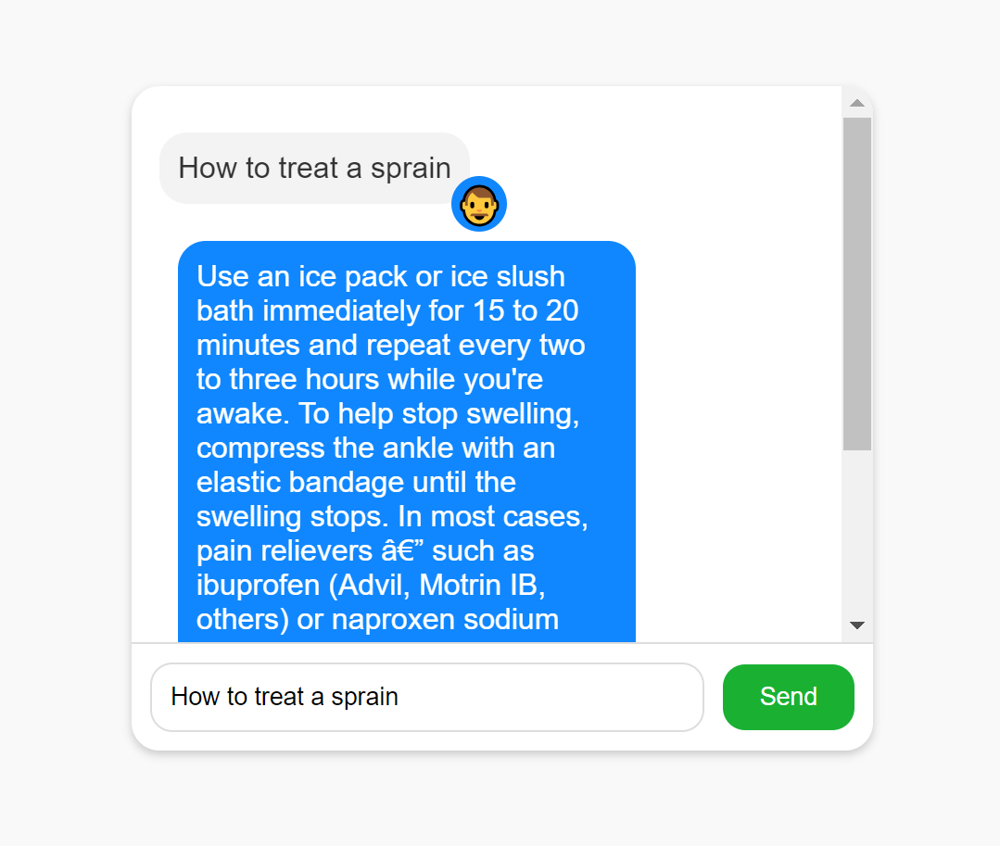

# Medical Chatbot

A simple medical chatbot built with Flask for the backend and plain HTML/CSS/JavaScript for the frontend. The chatbot answers medical-related questions and allows users to provide feedback on the responses.

## Installation

Clone the repository:

```bash
git clone https://github.com/yourusername/medical-chatbot.git
cd Medical-ChatBot
```

## Install the required packages:
```bash
pip install -r requirements.txt
```

## Run the Flask app:
```bash
python Backend/app.py
```
Open your browser and navigate to http://127.0.0.1:5000.

## Usage

- Type your question in the input box and click "Send".
- The chatbot will respond with an answer.
- Provide feedback by clicking the thumbs up (👍) or thumbs down (👎) button.

## ScreenShots 
```markdown
